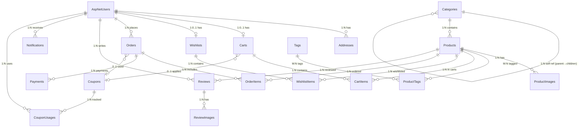

# GalleryBetak E-Commerce — Entity Relationships

## Entity Overview

| # | Table | Description |
|---|-------|-------------|
| 1 | AspNetUsers | Extended Identity users (customers, admins) |
| 2 | AspNetRoles | SuperAdmin, Admin, Customer |
| 3 | Categories | Self-referencing hierarchy (3 levels max) |
| 4 | Tags | Product tags for filtering |
| 5 | Products | Core product catalog |
| 6 | ProductImages | Product image gallery |
| 7 | ProductTags | M:N junction (Products ↔ Tags) |
| 8 | Addresses | User delivery addresses (Egyptian format) |
| 9 | Coupons | Discount codes |
| 10 | CouponUsages | Tracks who used which coupon on which order |
| 11 | Carts | Shopping cart (guest + authenticated) |
| 12 | CartItems | Items in cart with price snapshot |
| 13 | Wishlists | Per-user wishlist |
| 14 | WishlistItems | Items in wishlist |
| 15 | Orders | Customer orders with address snapshot |
| 16 | OrderItems | Product snapshot at order time |
| 17 | Payments | Payment transactions (Paymob, COD) |
| 18 | Reviews | Product ratings and comments |
| 19 | ReviewImages | Photos attached to reviews |
| 20 | Notifications | User notification inbox |
| 21 | AuditLogs | Immutable admin action log |
| 22 | SearchLogs | Search query analytics |

---

## Relationship Diagram (Mermaid)



---

## Detailed Relationships

### 1. User → Addresses (1:N)
- A user can have multiple delivery addresses
- **ON DELETE CASCADE**: When user is deleted, addresses are deleted
- Addresses have one default per user (enforced in application logic)

### 2. User → Cart (1:0..1)
- Each authenticated user has at most one cart
- Guest carts use SessionId instead of UserId
- **ON DELETE SET NULL on Cart.UserId**: If user deleted, cart becomes orphaned guest cart (cleaned by expiry)

### 3. User → Wishlist (1:0..1)
- Enforced by UNIQUE constraint on Wishlists.UserId
- Auto-created on first wishlist add
- **ON DELETE CASCADE**: Wishlist deleted with user

### 4. User → Orders (1:N)
- **ON DELETE SET NULL**: Orders preserved when user deleted (financial records)
- Order stores address snapshot, so user data isn't needed

### 5. Category → Category (Self-referencing 1:N)
- ParentId references Categories.Id
- **ON DELETE NO ACTION**: Cannot delete category with subcategories (enforced in business logic)
- Max depth: 3 levels (Root → Sub → Sub-sub)

### 6. Category → Products (1:N)
- **ON DELETE RESTRICT**: Cannot delete category with assigned products
- Products must belong to exactly one category

### 7. Products → ProductImages (1:N)
- **ON DELETE CASCADE**: Images deleted with product
- One image marked as IsPrimary (thumbnail)
- Max 8 images per product (enforced in application)

### 8. Products ↔ Tags (M:N via ProductTags)
- Junction table with composite PK (ProductId, TagId)
- **ON DELETE CASCADE** both sides: removing product or tag cleans junction

### 9. Cart → CartItems (1:N)
- **ON DELETE CASCADE**: Cart deletion clears all items
- CartItem stores UnitPrice snapshot at add time
- UNIQUE (CartId, ProductId): can't add same product twice, increment quantity instead

### 10. CartItem → Product (N:1)
- **ON DELETE RESTRICT**: Cannot delete product in someone's cart
- Application handles gracefully (marks unavailable)

### 11. Order → OrderItems (1:N)
- **ON DELETE CASCADE**: OrderItems deleted with order
- OrderItem stores complete product snapshot (name, SKU, price, image)
- Product reference is SET NULL on product deletion (snapshot preserved)

### 12. Order → Payments (1:N)
- Multiple payments possible (retries, partial refunds)
- **ON DELETE RESTRICT**: Cannot delete order with payment records

### 13. Coupon → CouponUsages (1:N)
- Tracks every usage with user, order, and discount amount
- UNIQUE (CouponId, UserId): each user can use a coupon only once
- **ON DELETE RESTRICT**: Cannot delete coupon with usage history

### 14. Review → ReviewImages (1:N)
- **ON DELETE CASCADE**: Images deleted with review
- Max 3 images per review (enforced in application)

### 15. Product → Reviews (1:N)
- **ON DELETE CASCADE**: Reviews deleted with product
- UNIQUE (UserId, ProductId): one review per user per product
- Product.AverageRating and Product.ReviewCount maintained by application

---

## Index Justification

| Index | Table | Columns | Purpose |
|-------|-------|---------|---------|
| IX_Products_CategoryId | Products | CategoryId + includes | Product list filtered by category |
| IX_Products_IsFeatured | Products | IsFeatured, IsActive | Featured products homepage section |
| IX_Products_Price | Products | Price + includes | Price range filter |
| IX_Products_Slug | Products | Slug | SEO-friendly URL lookup |
| IX_Products_CreatedAt | Products | CreatedAt DESC | New arrivals query |
| IX_Products_AverageRating | Products | AverageRating DESC | Rating filter/sort |
| IX_Products_LowStock | Products | StockQuantity < 5 | Admin low stock alert |
| FT_Products | Products | NameAr, NameEn, DescriptionAr, DescriptionEn | Full-text bilingual search |
| IX_Orders_UserId | Orders | UserId, CreatedAt DESC | User order history |
| IX_Orders_Status | Orders | Status, CreatedAt DESC + includes | Admin order management |
| IX_Orders_Revenue | Orders | CreatedAt, Status + includes | Revenue dashboard |
| IX_OrderItems_BestSellers | OrderItems | ProductId + includes | Best sellers calculation |
| IX_Payments_TransactionId | Payments | TransactionId (UNIQUE) | Webhook idempotency |
| IX_Reviews_Pending | Reviews | Status (Pending) + includes | Admin review moderation |
| IX_AuditLogs_Timestamp | AuditLogs | Timestamp DESC | Recent admin activity |
| IX_SearchLogs_ZeroResults | SearchLogs | ResultCount = 0 + includes | Analytics: improve catalog |
| IX_Notifications_Unread | Notifications | UserId, IsRead = 0 | Unread notification badge count |

---

## Covering Indexes (Top 5 Query Patterns)

### 1. Product List Page (most executed)
```sql
-- Covered by IX_Products_CategoryId
SELECT Id, NameAr, NameEn, Slug, Price, OriginalPrice, IsFeatured, IsActive
FROM Products
WHERE CategoryId = @catId AND IsActive = 1 AND IsDeleted = 0
ORDER BY CreatedAt DESC
OFFSET @skip ROWS FETCH NEXT @take ROWS ONLY;
```

### 2. Featured Products Homepage
```sql
-- Covered by IX_Products_IsFeatured
SELECT Id, NameAr, NameEn, Slug, Price, OriginalPrice
FROM Products
WHERE IsFeatured = 1 AND IsActive = 1 AND IsDeleted = 0
ORDER BY DisplayOrder;
```

### 3. User Order History
```sql
-- Covered by IX_Orders_UserId
SELECT Id, OrderNumber, Status, TotalAmount, CreatedAt
FROM Orders
WHERE UserId = @userId AND IsDeleted = 0
ORDER BY CreatedAt DESC;
```

### 4. Admin Order Dashboard
```sql
-- Covered by IX_Orders_Status
SELECT OrderNumber, UserId, TotalAmount, PaymentStatus, CreatedAt
FROM Orders
WHERE Status = @status AND IsDeleted = 0
ORDER BY CreatedAt DESC;
```

### 5. Revenue Report
```sql
-- Covered by IX_Orders_Revenue
SELECT CAST(CreatedAt AS DATE) AS Date, SUM(TotalAmount) AS Revenue, COUNT(*) AS OrderCount
FROM Orders
WHERE CreatedAt BETWEEN @from AND @to
  AND Status NOT IN ('Cancelled', 'Refunded')
  AND IsDeleted = 0
GROUP BY CAST(CreatedAt AS DATE);
```

